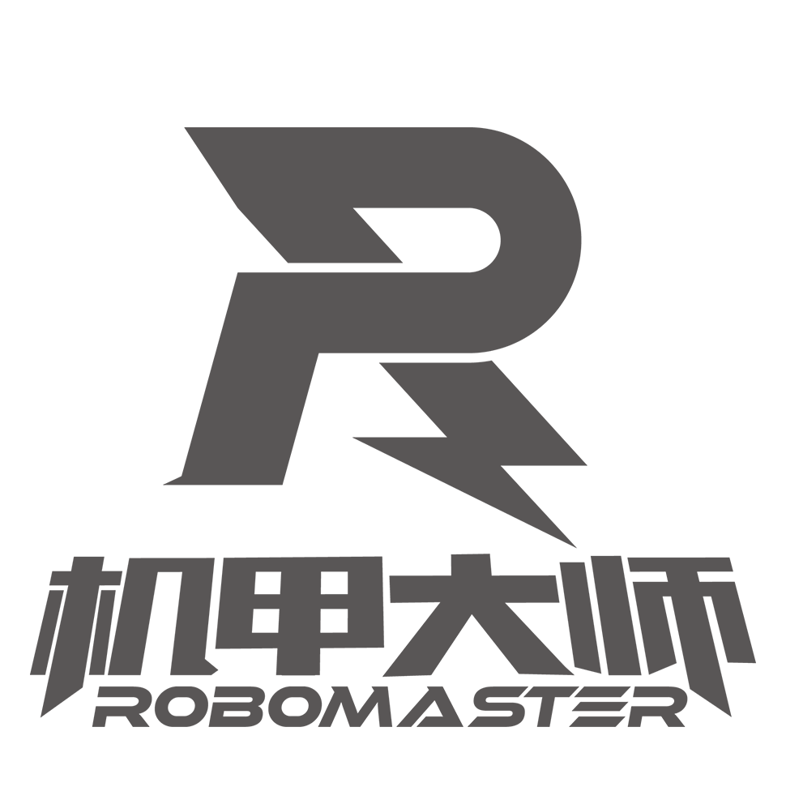
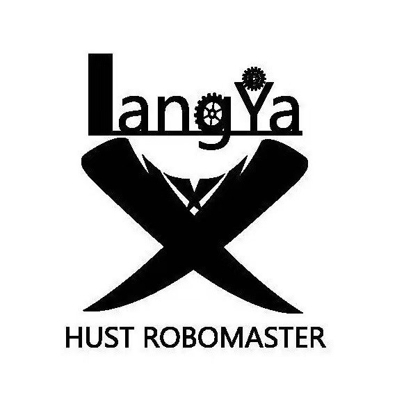

# Hust_Radar_2025
2025赛季狼牙战队雷达站代码仓库&开源


<div align="center" float="left">

<a href="https://www.robomaster.com/zh-CN">



</a>

&nbsp;&nbsp;&nbsp;&nbsp;&nbsp;&nbsp;&nbsp;&nbsp;&nbsp;



</div>

<br>

<div align="center">

<b> 华中科技大学 狼牙战队 视觉组 </b>

 </div>


## 功能简介 🔎

本赛季雷达站继承自上赛季的框架，集成了不同模式的传感器融合方案，以及低成本的单目相机方案，并支持扩展多相机，以及推出新的多机通信决策和传感器融合方案

- 联合标定传感器后融合方案，传感器前融合和单目相机方案可无缝切换（仅修改配置文件）
- 基于Kalman Filter和Hungary 算法的多传感器融合方案，减少误匹配
- 基于拓扑图的哨兵决策系统，和盲区预测系统
- 英雄辅助吊射，和英雄保护预警

## 环境配置 🛠

### 硬件环境 📡

#### 一、传感器平台

| 硬件     |                           型号                           |
| -------- | :------------------------------------------------------: |
| 工业相机 | 海康威视工业相机 29.2fps@4024*3036 MV-CU120-10UC *1 870r |
| 镜头     |      海康威视 8mm工业镜头 MVL-HF0824M-10MP *1 250r       |
| 激光雷达 |              Livox Mid-70激光雷达 *1 3600r  （本赛季未上场）             |

#### 二、算力平台

| 硬件   | 型号                     |
| ---- | ---------------------- |
| 算力平台 | 自组主机                   |
| CPU  | 第 14 代英特尔酷睿 i7-14700kf |
| GPU  | NVIDIA RTX 4090 D      |

>主线程约70Hz
>
>检测线程约30Hz（受限于相机采集帧率）
>
>仅运行检测约200Hz

### 软件环境 🖥

```
MVS
MVS_SDK
ros(noetic)
Livox-SDK
livox-ros-driver

torch
ultralytics
open3d
timm
pyserial
opencv-python
efficientnet_pytorch
cupy
rospy
scipy
```

具体配置方法可参考[雷达主机环境配置文档](https://docs.qq.com/doc/DZFFWV3ZJcFVlb3lB?)

### 运行 🚀

从[百度网盘分享密码HUST](https://pan.baidu.com/s/1MK92NfBCb8PhtyJTz9ZiwQ?pwd=HUST)下载video.avi和rosbag.avi，将rosbag.avi后缀改为rosbag.bag后，均放于data文件夹下

##### 1.无硬件环境完整demo（目前仅支持单目相机测试）

**注意：需要插上USB转ttl才可正常运行！**

###### 路径修改：

```python
# 1. 修改25main_without_lidar.py中line 18
mode = "video" # "video" or camera
# 2. 修改main.py中line 22
video_path = "path/to/video.avi"
```

###### 终端运行

```shell
activate your virtual environment
# 没做对齐，需迅速启动
python path/to/Hust-Radar-2024/main.py 
```

##### 2.无硬件目标检测模块video-mode

###### 路径修改：

```python
# 1. 确保detect_thread_test.py中line 12
mode = "video" # "video" or camera
# 2. 修改line 16
video_path = "path/to/yout_video.avi"
```

###### 终端运行

```shell
python path/to/Hust-Radar-2024/detect_thread_test.py 
```

##### 3.有硬件环境运行

**3.1 传感器后融合/联合标定方案** 

需确保相机为海康系列,且安装MVS与MVS-SDK

需确保激光雷达为Livox系列，且安装Livox-SDK与livox-ros-driver

1.修改配置文件

```python
# 1. /configs/bin_cam_config.yaml下
id:
    new_cam:<your_id> # 将new_cam的id改为你的相机的id
    
param: # 按需修改为对应的参数
    Width: <your_width> 
    Height: <your_height>
    Gain: <your_gain> # 注意！此处增益一定要小于你相机的最大增益，否则会无法运行
    show_width: <your_show_width> # 可视化时的宽高，按显示器来
    show_height: <your_show_height>

# 2. main.py下
mode = "camera" # "video" or "camera"

# 3.config/main_config.yaml下
global:
    my_color: "Blue" # "Blue" or "Red" 对应颜色，注意大写

lidar:
    lidar_topic_name: <your_lidar_topic_name> # 你的激光雷达发布的话题名称
    
# 4.converter_config.yaml
params:
    width: <camera_width> # 你相机图像的宽
    height: <camera_height> # 相机图像的高
calib:
    # 修改你的相机内参与相机与激光雷达的外参矩阵

```

2.启动激光雷达节点

```shell
roslaunch livox_ros_driver livox_lidar_rviz.launch
```

3.启动程序

```shell
python main.py
```


**3.2 传感器后融合方案** 
首先，编译目录下pclmatcher的ros/c++模块
```shell
cd path/to/pclmatcher
catkin_make
# 注意如果使用类似于conda的虚拟环境可能需要修改CMakeLists来指定python compiler或者加上命令行参数
catkin_make -DPYTHON_EXECUTABLE=/path/to/your/python/compiler
```

然后 运行auto_start.sh自启动脚本
```shell
chmod a+X ./start_ros.sh
./start_ros.sh
```
最后，运行python主程序
```shell
cd path/to/25_main.py
python 25_main.py
```

如果只有单目相机（最简单/最推荐）
```shell
python 25main_without_lidar.py
```

## 文件目录结构 📂

```shell
.
├── detect		       检测模块
│   ├── _init_.py
│   ├── Capture.py              相机源驱动类
│   ├── Detector.py             目标检测类
│   └── Video.py                视频源类
├── Lidar		       定位模块
│   ├── _init_.py
│   ├── Converter.py            坐标转换类
|   ├── Vision_locator          单目相机定位类
│   ├── Lidar.py                激光雷达类
│   └── PointCloud.py           自定义点云数据结构
├── communication		通信模块
|   ├── Topo_Predictor          基于拓扑图的预测器
│   ├── _init_.py
│   ├── Messager.py             通信类
│   ├── Sender.py               发送类
│   ├── Receiver.py             接收类
│   └── Messager_test.py        通信测试
├── Car		            车辆信息数据结构
│   ├── _init_.py
│   └── Car.py                  车辆信息与车辆列表数据结构类
├── configs				配置文件
│   ├── bin_cam_config.yaml		相机驱动文件
│   ├── bytetrack.yaml          bytetrack参数文件
│   ├── converter_config.yaml   相机内外参与converter参数文件
│   ├── detector_config.yaml    检测模型路径与detector参数文件
│   └── main_config.yaml        总参数文件
├── weights/            模型文件夹
├── Point_Tracker/      传感器融合
├── pclmatcher          基于华农的点云配准模块（感谢聪哥）
├── stereo_camera/      相机驱动依赖
├── camera/             相机驱动依赖
├── Tools/              工具类
├── Log/                Log类
├── ultralytics/        ultralytics魔改包
├── camera.py           仅运行相机
├── detect_thread_test.py  仅运行检测线程
└── main.py             主线程文件
```

## 基本算法阐述 ♾️

### 两阶段检测 🎯

#### 一阶段追踪 🎯

我们采用4k图像输入和YOLOv8 + bytetrack算法，来获取图像中所有车辆的整车bounding box。4k图像帮助我们可以很好的进行远距离小目标识别，然后利用bytetrack算法对整车bbox进行目标追踪，每一个bbox维护一个追踪器和track_id

#### 二阶段分类 ♾️

将一阶段的bbox作为ROI（Region Of Interest）送入二阶段分类网络（YoloV8），得到车辆分类信息并于追踪器tracker的信息整合，用于后续目标定位和传感器融合

#### 目标定位 🚀

##### 1. 传感器前融合和联合标定方法：

这种方法的核心在于需要有精确的雷达和相机外参变换矩阵，来构建传感器之间的信息流

首先，我们可以拿到车辆在图像坐标系中坐标，然后我们为了确定深度信息，需要将激光雷达点云投影至相机和图像坐标系来得到bbox内的点云，然后做一次聚类来防止背景对定位的干扰，接着将聚类后的聚类中心坐标通过和相机和赛场的外参矩阵投影至赛场坐标系完成目标定位
![[front_fusion.png]](https://github.com/HUSTLYRM/Hust_Radar_2025/blob/main/asset/front_fusion.png)


##### 2. 点云配准差分+传感器后融合

首先，我们对点云数据做预处理，考虑到官方会开源场地地图，而场地对于点云数据来说是不变静态的障碍物，而这对于定位来说可以不用考虑因为我们只需要那些运动的小车，所以我们可以将传感器点云向赛场点云进行配准，而后差分便可得到赛场上的动态障碍物点云，以下称为动态点云

然后我们使用卡尔曼滤波器维护一个动态点云追踪队列，来构建不同帧点云之间的联系

接着，我们处理图像部分:
这里我们参考了TDT战队和厦门理工在2024年的投射变换方法， 首先我们通过两阶段神经网络，得到小车bbox，然后我们考虑到在图像中不同位置的取点方式应该有所不同，我们加强了取点逻辑为了更好的定位。然后判断取点所在场地区域，得到对应区域高度，进行投射变换，此处我们标了6处不同的高度，以取得最精确的定位结果

这样，我们就有了两组在相同坐标系（赛场坐标系）下的xyz坐标，如果没有雷达，就可以直接使用单目相机结果。如果使用激光雷达，请看下文，传感器融合步骤

### 传感器融合和冲突处理 🎯

我们的传感器融合是在robomaster官方赛场坐标系下完成，通过点云差分和单目视觉处理后即可得到在赛场坐标系下的坐标

首先我们对动态点云进行聚类得到中心点，然后对动态点云以帧间距离为判据维护追踪队列，然后用视觉信息向追踪队列进行匹配：
- 匹配判据：点云追踪队列中历史存储的颜色和id信息/视觉定位坐标和点云队列的最近距离
- 匹配算法：这其实是一个二部图最佳匹配问题（OIer很熟悉了），简单跑一个匈牙利算法就行

### 多机通信🚀

在上赛季我就已有雷达与哨兵等己方机器人联动，让雷达成为真正的团队大脑的设想。本赛季在阅读裁判系统串口附录并与嵌软联调确定可行性后，通过己方机器人自定义信息链路，与己方不同机器人约定一套子id来实现功能信息的发送。本赛季在上赛季基础上进一步开发了多机通信和决策，以及辅助进攻。具体有**英雄辅助吊射，基于拓扑图的哨兵导航点决策，英雄预警**

###### 链路①：哨兵预警角

在赛场坐标系解算己方哨兵与最近的敌方单位的位姿，向哨兵发送：**最近敌方ID、方位角和距离。**

###### 链路②：哨兵全向感知

在赛场坐标系解算己方哨兵与所有敌方敌方单位的坐标，向哨兵发送：**己方哨兵与所有敌方单位的x，y坐标。**

###### 链路③：英雄预警

根据决策功能，判断在敌方英雄位于准备下台阶到上到己方环高的路上时，向哨兵发送：**前往环高增益点夹击英雄的指令。**

###### 链路④：雷达双倍易伤次数转发

将雷达拥有双倍易伤次数转发到己方步兵机器人上，再由步兵嵌软将双倍易伤次数画到操作手ui上，云台手即可通与步兵操作手沟通（窥屏五号操作手，来了解自己是否能通过飞镖目标切换主动触发双倍易伤。

#### 2025新决策系统：

- 英雄辅助吊射：基于英雄定位信息和吊射弹道方程直接解算pitch角发送
- 拓扑图哨兵导航点：将赛场划分成不同区域，建立边节点关系（可进攻/可到达），然后利用图论算法可计算得到哨兵移动路径和目标点
- 英雄预警：为了保证英雄不被多次切死，可以计算敌方兵种和英雄之间的距离，发送给英雄机器人在UI上以深浅体现距离远近

### 双倍易伤决策 🎯

本赛季仅使用云台手主动触发方法

###### 方案①：主动请求

分区赛后，借鉴辽科雷达开源思路，**与云台手约定飞镖目标为随机靶且雷达拥有双倍易伤时，转发双倍易伤请求**。由操作间发出的请求更为准确，可以实现较为有效地利用双倍易伤。

在与步兵机器人的自定义通信链路调通后，增加了将雷达可使用双倍易伤次数转发到步兵操作手界面上，云台手可通过与步兵操作手沟通了解目前是否可主动请求双倍易伤，让双倍易伤的触发时机更加精确。


## 软件与硬件的系统框图
![[flow.png]](https://github.com/HUSTLYRM/Hust_Radar_2025/blob/main/asset/flow_Chart.png)

## 未来优化方向 🚀

支持多相机的框架
优化内录逻辑
## 致谢 🙏
感谢本赛季狼牙战队视觉组和雷达组的所有成员，感谢他们在这个赛季的努力和付出。

感谢东北大学TDT战队、华南农业大学Tarutus等优秀战队的开源引领以及狼牙战队视觉组的老人们的帮助！

## 联系方式 📇

mail: jyk041029@gmail.com

QQ: 2107740571

如果有用麻烦点个star🙏有问题可以直接提issue


